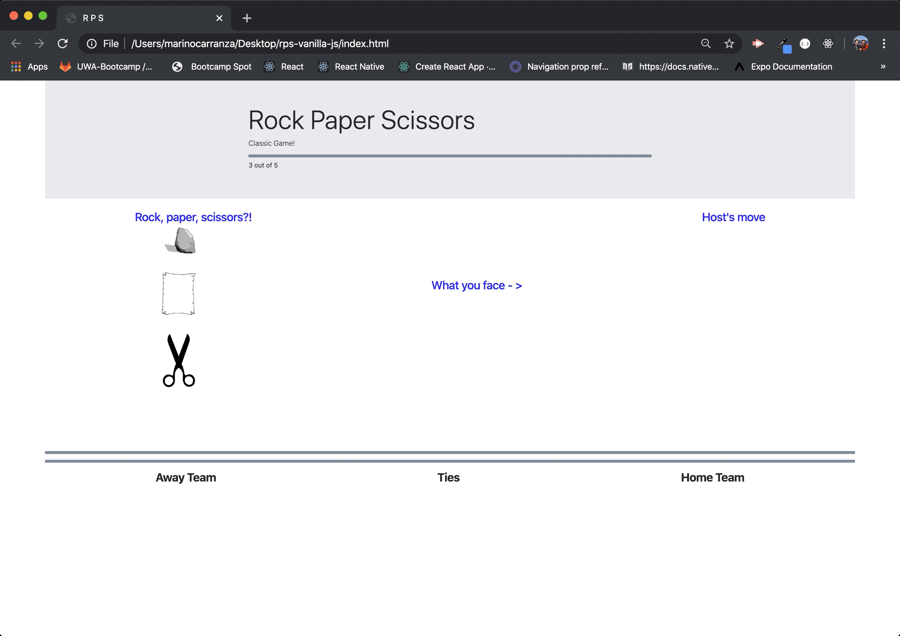

# **rps-vanilla-js**

# **Description**
Rock, paper, scissors game, user opens up the game by making a choice (clicking on one of the images) and then the host answers with a randomly generated response of its own.
The game goes on for five rounds, keeping score per match; after five rounds the results are displayed and a 5 second counter starts, at the end the game restarts.

## **Purpose**
I created this app as a practical exercise of vanilla js skills, I wrote this from scratch just to see how it went.

## **Support**
Feel free to contact me marino.carranza@gmail.com with any questions you may have about this app.

## **Contributing**
I am the sole contributor to this app.

## **Roadmap**
I have no major plans for development, I might add style to it if I feel the need to practice css or play around with bootstrap, again, the purpose of the app was to practice vanilla js.

## **Technologies**
• Javascript

• Jquery

• css

• Bootstrap

## **Take a look at how it works**

## **General Notes**
Feel free to fork, clone, download this app as you seem fit, please do let me know if you have any tips, variations or something new to try.  Thanks.
